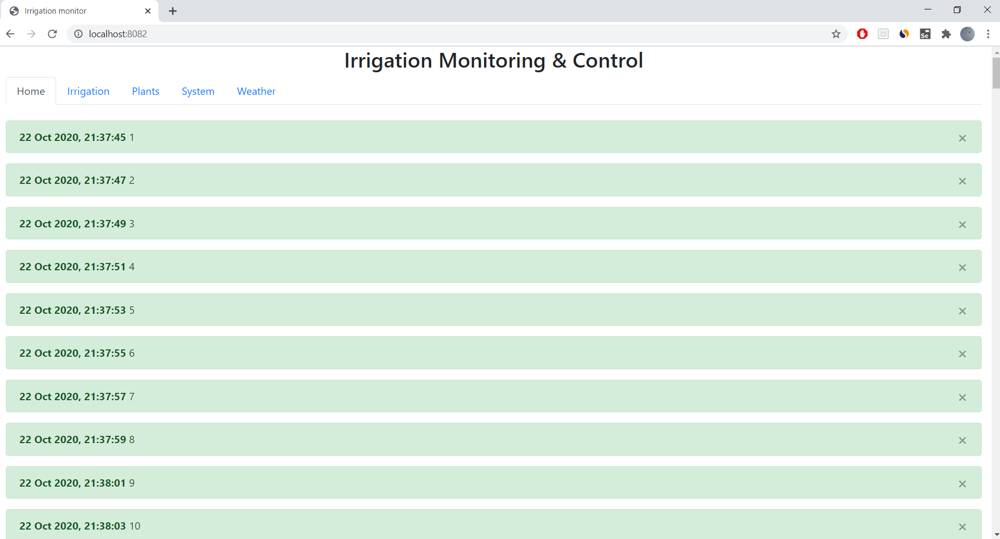
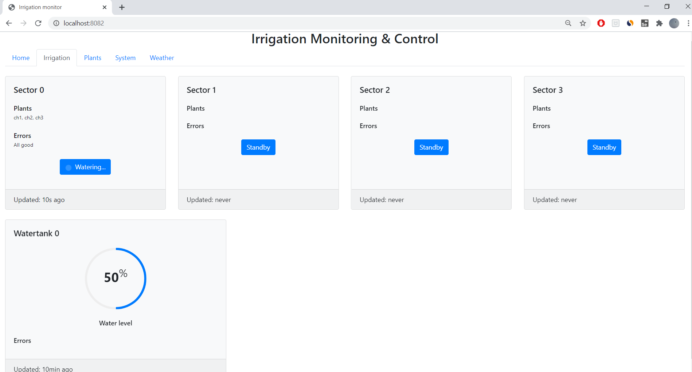
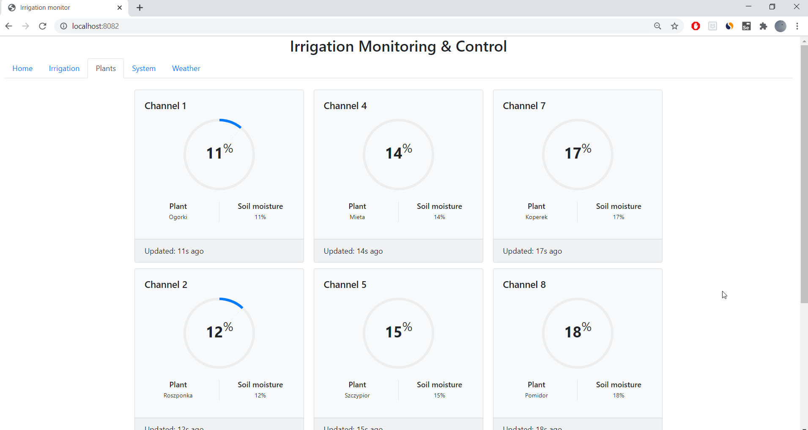
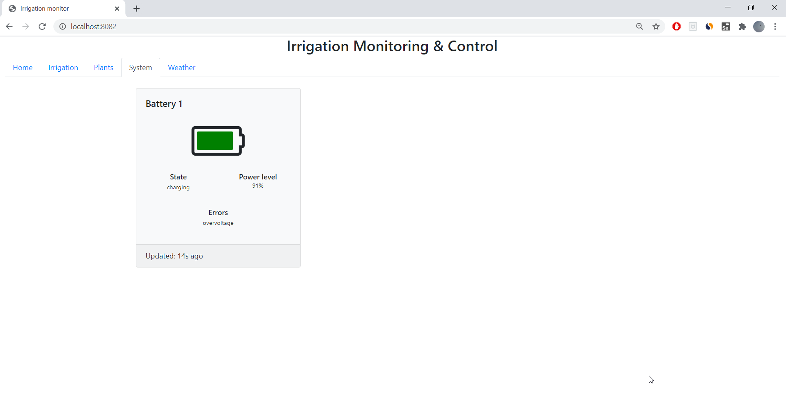
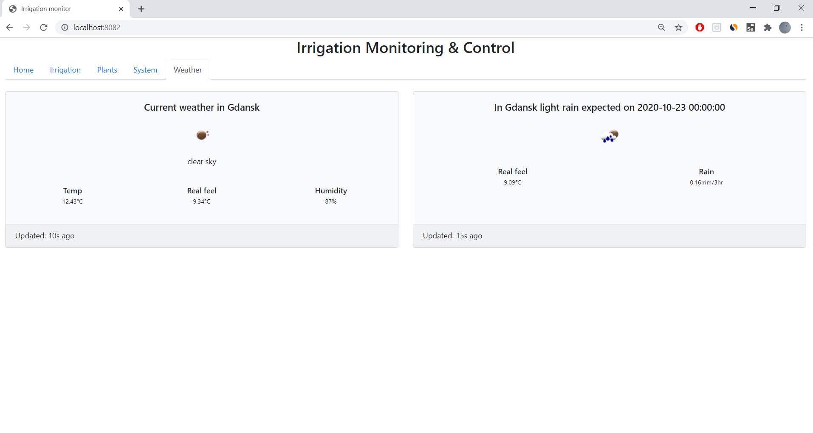

# IrrigationMonitoring

Python program with C/C++ libraries (boost.python wrappers) that controls irrigation of plants and reports their status.\
Hardware used: Raspberry Pi 3, NRF24L01.

Web-based Live Dashboard Preview (WIP): 
Technologies used: Bootstrap, Flask, OpenWeatherMap API

